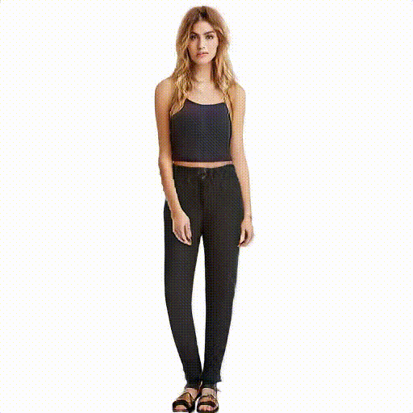
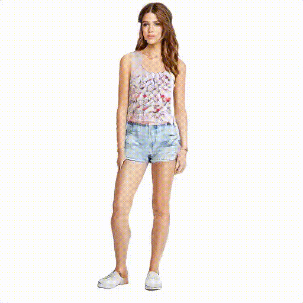
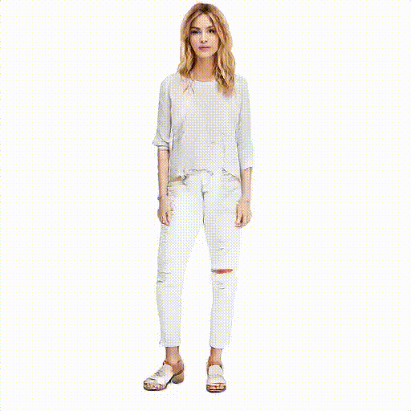
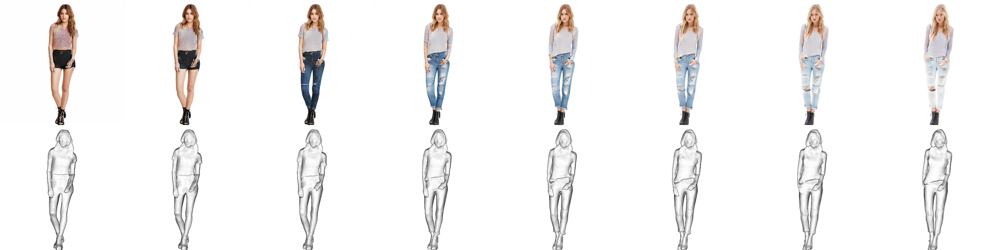
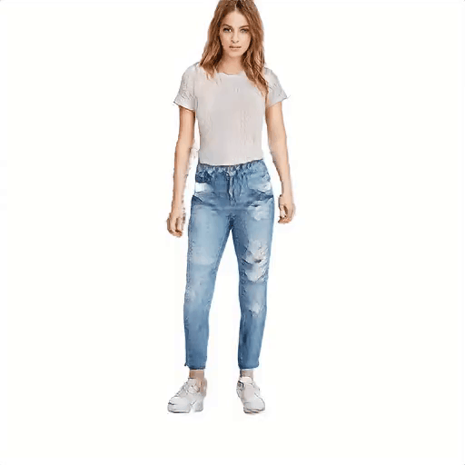
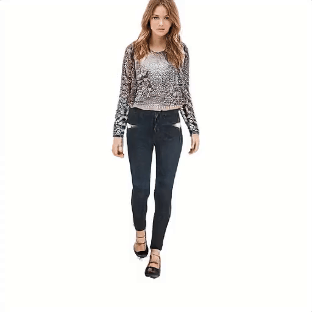

# AG3D: Learning to Generate 3D Avatars from 2D Image Collections (ICCV 2023)
## [Paper](https://arxiv.org/abs/2305.02312) | [Supplementary](https://files.ait.ethz.ch/projects/ag3d/ag3d_supplementary.pdf) | [Video](https://youtu.be/niP1YhJXEBE) | [Project Page](https://zj-dong.github.io/AG3D/)

 


Official code will be released soon for ICCV 2023 paper [*AG3D: Learning to Generate 3D Avatars from 2D Image Collections*](https://arxiv.org/abs/2305.02312). Learned from 2D image collections, AG3D synthesizes novel 3D humans with high-quality appearance and geometry, different identities and clothing styles including loose clothing such as skirts.

# News:

- [2023/09/13] Inference codes and evaluation are released!
- [2023/07/14] AG3D is accepted to ICCV 2023!


# Who needs AG3D?

- If you want to **train** a 3D generative model of humans from your own 2D image collections.
- Our model can generate:
  - image
    - posed/canonical human RGB
    - posed/canonical human normal
    - raw rendering
  - mesh:
    - 3D corresponding clothed human geometry
  - animation
  - interpolation
  - novel view synthesis
- We also provide our pretrained models from DeepFashion and UBCFashion. You can easily finetune them with your own dataset.


# Quick Start


## Requirements

* 1&ndash;8 high-end NVIDIA GPUs. We have done all testing and development using V100 and A100 GPUs.
* 64-bit Python 3.8 and PyTorch 1.11.0 (or later). See https://pytorch.org for PyTorch install instructions.
* CUDA toolkit 11.3 or later. 
* pytorch3d. See https://github.com/facebookresearch/pytorch3d/blob/main/INSTALL.md for install instructions.

Clone this repo:

```
git clone https://github.com/zj-dong/AG3D.git
cd AG3D
```
We suggest to use anaconda to manage the python environments:

```
conda env create -f env.yml
conda activate ag3d
python setup.py install
```
## Download Pose Distribution and Models

Download [SMPL models](https://smpl.is.tue.mpg.de) (1.0.0 for Python 2.7 (10 shape PCs)) and move them to the corresponding locations:

```
mkdir training/deformers/smplx/SMPLX
mv /path/to/smpl/models/basicModel_f_lbs_10_207_0_v1.0.0.pkl training/deformers/smplx/SMPLX/SMPL_NEUTRAL.pkl
```

Download our pretrained models: 
```
sh ./scripts/download_model.sh
```

Download pose distribution of training data:
```
sh ./scripts/download_pose.sh
```


## Generate random samples 

DeepFashion:
```
python test.py --network=./model/deep_fashion.pkl  --pose_dist=./data/dp_pose_dist.npy --output_path './result/deepfashion' --res=512 --truncation=0.7 --number=100 --type=gen_samples
```
UBCFashion:

```
python test.py --network=./model/ubc_fashion.pkl  --pose_dist=./data/ubc_pose_dist.npy --output_path './result/ubc' --res=512 --truncation=0.7 --number=100 --type=gen_samples
```


# Inference
Generate results of novel view synthesis:
```
python test.py --network=./model/deep_fashion.pkl  --pose_dist=./data/dp_pose_dist.npy  --output_path='./result/gen_novel_view' --res=512 --truncation=0.7 --number=100 --type=gen_novel_view
```

Some sampled generated results are shown below. 

<p align="center">
     
</p>

Generate interpolation results:
```
python test.py --network=./model/deep_fashion.pkl   --pose_dist=./data/dp_pose_dist.npy  --output_path='./result/result_interp' --res=512 --truncation=0.7 --number=100 --type=gen_interp --is_mesh=True
```
Some sampled interpolation results:
<p align="center">
   
</p>

Generate animations (please download motion sequence from [AMASS](https://amass.is.tue.mpg.de/)):
```
python test.py --network=./model/deep_fashion.pkl   --pose_dist=./data/dp_pose_dist.npy  --output_path='./result/result_anim' --res=512 --truncation=0.7 --number=100 --type=gen_anim  --motion_path=./data/animation/motion_seq
```

Some sampled animation results:


<p align="center">
     
 
</p>

# Evaluation

Calculate metrics in the paper:

```
python evaluate.py --metrics=fid5k_full --network=./model/deep_fashion.pkl --data=./data/eva3d_icon.zip  --res=512 
```

# Citation

If you find our code or paper useful, please cite as
```
@inproceedings{dong2023ag3d,
      title={{AG3D}: {L}earning to {G}enerate {3D} {A}vatars from {2D} {I}mage {C}ollections},
      author={Dong, Zijian and Chen, Xu and Yang, Jinlong and  Black, Michael J and Hilliges, Otmar and Geiger, Andreas},    
      booktitle   = {International Conference on Computer Vision (ICCV)},
      year      = {2023}
      }
```


# Acknowledgements


We thank for their feedback and discussions. 

Here are some great resources we benefit from:

- [EG3D](https://nvlabs.github.io/eg3d/) for the general 3D GAN structure and 3D representation
- [PIFuHD](https://shunsukesaito.github.io/PIFuHD/), [ICON](https://github.com/YuliangXiu/ICON) for Normal Estimation and Preprocessing
- [fast-SNARF](https://github.com/xuchen-ethz/fast-snarf) for Human Deformation
- [NeRF](https://github.com/bmild/nerf), [StyleSDF](https://github.com/royorel/StyleSDF), [VolSDF](https://github.com/lioryariv/volsdf) for Volumetric Rendering
- [smplx](https://smpl-x.is.tue.mpg.de/), [PyMAF](https://github.com/HongwenZhang/PyMAF) for Human Pose and Shape Estimation 
- [PaddleSeg](https://github.com/PaddlePaddle/PaddleSeg) and [RVM](https://github.com/PeterL1n/RobustVideoMatting) for Background Removal
- [DeepFashion](https://liuziwei7.github.io/projects/DeepFashion.html) and [UBC Fashion](https://vision.cs.ubc.ca/datasets/fashion/) for Dataset

This project was supported by the ERC Starting Grant
LEGO-3D (850533), the BMWi project KI Delta Learning
(project number 19A19013O) and the DFG EXC number
2064/1 - project number 390727645. 


